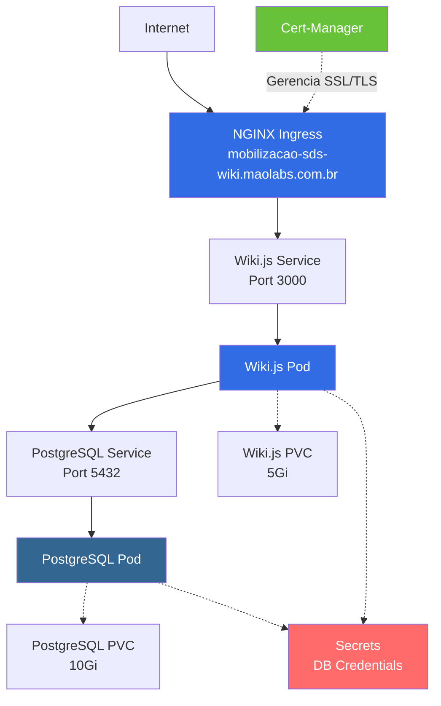

# Wiki.js - Mobilização SDS

Deployment do Wiki.js para o namespace SDS (Secretaria de Situação da UNB) no Kubernetes, acessível através do domínio `mobilizacao-sds-wiki.maolabs.com.br`.

## 📋 Visão Geral

Este repositório contém os manifestos Kubernetes necessários para fazer o deploy de uma instância do Wiki.js com banco de dados PostgreSQL, incluindo:

- **Wiki.js**: Plataforma de documentação moderna e poderosa
- **PostgreSQL**: Banco de dados relacional para armazenamento
- **Ingress NGINX**: Roteamento de tráfego HTTP/HTTPS
- **Cert-Manager**: Gerenciamento automático de certificados SSL/TLS

## 🏗️ Arquitetura



## 🔧 Pré-requisitos

Antes de fazer o deploy, certifique-se de ter:

1. **Cluster Kubernetes** configurado e acessível
2. **kubectl** instalado e configurado para acessar o cluster
3. **NGINX Ingress Controller** instalado no cluster
4. **Cert-Manager** instalado e configurado com o ClusterIssuer `letsencrypt-prod`
5. **DNS** configurado apontando `mobilizacao-sds-wiki.maolabs.com.br` para o IP do Ingress Controller

### Verificar Pré-requisitos

```bash
# Verificar acesso ao cluster
kubectl cluster-info

# Verificar NGINX Ingress Controller
kubectl get pods -n ingress-nginx

# Verificar Cert-Manager
kubectl get pods -n cert-manager

# Verificar ClusterIssuer
kubectl get clusterissuer letsencrypt-prod
```

## 🚀 Deployment

### 1. Configurar Secrets

**IMPORTANTE**: Antes de fazer o deploy, edite o arquivo `04-secrets.yaml` e altere as credenciais padrão:

```bash
# Edite o arquivo e altere a senha
nano 04-secrets.yaml
```

Altere os valores em `stringData`:
- `POSTGRES_USER`: Nome de usuário do banco de dados
- `POSTGRES_PASSWORD`: **Senha forte e segura**
- `POSTGRES_DB`: Nome do banco de dados

### 2. Aplicar os Manifestos

Execute os comandos na ordem correta:

```bash
# 1. Criar o namespace
kubectl apply -f 01-namespace.yaml

# 2. Criar os PersistentVolumeClaims
kubectl apply -f 02-postgres-pvc.yaml
kubectl apply -f 03-wikijs-pvc.yaml

# 3. Criar os Secrets
kubectl apply -f 04-secrets.yaml

# 4. Deploy do PostgreSQL
kubectl apply -f 05-postgres-deployment.yaml
kubectl apply -f 06-postgres-service.yaml

# 5. Aguardar PostgreSQL estar pronto
kubectl wait --for=condition=ready pod -l app=postgres -n sds --timeout=300s

# 6. Deploy do Wiki.js
kubectl apply -f 07-wikijs-deployment.yaml
kubectl apply -f 08-wikijs-service.yaml

# 7. Configurar Ingress
kubectl apply -f 09-wikijs-ingress.yaml
```

**Ou aplicar todos de uma vez** (após configurar os secrets):

```bash
kubectl apply -f .
```

### 3. Verificar o Deployment

```bash
# Verificar todos os recursos no namespace
kubectl get all -n sds

# Verificar os pods
kubectl get pods -n sds

# Verificar logs do Wiki.js
kubectl logs -f deployment/wikijs -n sds

# Verificar logs do PostgreSQL
kubectl logs -f deployment/postgres -n sds

# Verificar o Ingress
kubectl get ingress -n sds

# Verificar o certificado TLS
kubectl get certificate -n sds
```

## 🌐 Configuração DNS

Configure um registro DNS do tipo **A** ou **CNAME** apontando para o IP do seu Ingress Controller:

```bash
# Obter o IP do Ingress Controller
kubectl get svc -n ingress-nginx
```

Exemplo de configuração DNS:
```
mobilizacao-sds-wiki.maolabs.com.br  A  <IP_DO_INGRESS>
```

## 🔐 Certificado SSL/TLS

O Cert-Manager irá automaticamente solicitar e renovar o certificado SSL/TLS do Let's Encrypt. Aguarde alguns minutos após o deploy para o certificado ser emitido.

Verificar o status do certificado:

```bash
kubectl describe certificate mobilizacao-sds-wiki-tls -n sds
```

## 📝 Configuração Inicial do Wiki.js

1. Acesse `https://mobilizacao-sds-wiki.maolabs.com.br`
2. Na primeira execução, você será direcionado para o setup inicial
3. Configure:
   - **Email do administrador**
   - **Senha do administrador**
   - **URL do site**: `https://mobilizacao-sds-wiki.maolabs.com.br`
4. Complete o wizard de configuração

## 📦 Recursos Alocados

### PostgreSQL
- **CPU**: 250m (request) / 500m (limit)
- **Memória**: 256Mi (request) / 512Mi (limit)
- **Storage**: 10Gi

### Wiki.js
- **CPU**: 250m (request) / 1000m (limit)
- **Memória**: 256Mi (request) / 1Gi (limit)
- **Storage**: 5Gi

## 🔍 Troubleshooting

### Pod não inicia

```bash
# Verificar eventos do pod
kubectl describe pod <pod-name> -n sds

# Verificar logs
kubectl logs <pod-name> -n sds
```

### Problemas de conexão com o banco de dados

```bash
# Verificar se o PostgreSQL está rodando
kubectl get pods -l app=postgres -n sds

# Testar conectividade do Wiki.js ao PostgreSQL
kubectl exec -it deployment/wikijs -n sds -- nc -zv postgres 5432
```

### Certificado SSL não é emitido

```bash
# Verificar o status do certificado
kubectl describe certificate mobilizacao-sds-wiki-tls -n sds

# Verificar logs do cert-manager
kubectl logs -n cert-manager deployment/cert-manager

# Verificar CertificateRequest
kubectl get certificaterequest -n sds
```

### Ingress não responde

```bash
# Verificar configuração do Ingress
kubectl describe ingress wikijs-ingress -n sds

# Verificar logs do NGINX Ingress
kubectl logs -n ingress-nginx deployment/ingress-nginx-controller
```

### Resetar senha do administrador

```bash
# Acessar o pod do Wiki.js
kubectl exec -it deployment/wikijs -n sds -- /bin/sh

# Dentro do pod, executar o comando de reset
node wiki reset-admin-password
```

## 🔄 Backup e Restore

### Backup do PostgreSQL

```bash
# Criar backup do banco de dados
kubectl exec -it deployment/postgres -n sds -- pg_dump -U wikijs wikijs > backup-$(date +%Y%m%d).sql
```

### Restore do PostgreSQL

```bash
# Restaurar backup
cat backup-YYYYMMDD.sql | kubectl exec -i deployment/postgres -n sds -- psql -U wikijs wikijs
```

### Backup dos volumes

É recomendado configurar snapshots automáticos dos PersistentVolumes através do seu provedor de cloud ou solução de backup do Kubernetes.

## 🔧 Manutenção

### Atualizar Wiki.js

```bash
# Editar o deployment e alterar a versão da imagem
kubectl edit deployment wikijs -n sds

# Ou aplicar uma nova versão via manifesto
# Altere a tag da imagem em 07-wikijs-deployment.yaml
kubectl apply -f 07-wikijs-deployment.yaml
```

### Escalar recursos

```bash
# Aumentar recursos do Wiki.js
kubectl edit deployment wikijs -n sds

# Aumentar storage (requer suporte do StorageClass)
kubectl edit pvc wikijs-pvc -n sds
```

### Monitoramento

Considere integrar com ferramentas de monitoramento como:
- **Prometheus + Grafana**: Métricas de recursos
- **ELK Stack**: Logs centralizados
- **Uptime Kuma**: Monitoramento de disponibilidade

## 📚 Recursos Adicionais

- [Documentação Oficial do Wiki.js](https://docs.requarks.io/)
- [Wiki.js GitHub](https://github.com/requarks/wiki)
- [PostgreSQL Documentation](https://www.postgresql.org/docs/)
- [Kubernetes Documentation](https://kubernetes.io/docs/)
- [NGINX Ingress Controller](https://kubernetes.github.io/ingress-nginx/)
- [Cert-Manager Documentation](https://cert-manager.io/docs/)

## 📄 Estrutura dos Arquivos

```
.
├── 01-namespace.yaml              # Define o namespace 'sds'
├── 02-postgres-pvc.yaml           # PVC para dados do PostgreSQL (10Gi)
├── 03-wikijs-pvc.yaml             # PVC para dados do Wiki.js (5Gi)
├── 04-secrets.yaml                # Credenciais do banco de dados
├── 05-postgres-deployment.yaml    # Deployment do PostgreSQL
├── 06-postgres-service.yaml       # Service do PostgreSQL
├── 07-wikijs-deployment.yaml      # Deployment do Wiki.js
├── 08-wikijs-service.yaml         # Service do Wiki.js
├── 09-wikijs-ingress.yaml         # Ingress com TLS
└── README.md                      # Este arquivo
```

## 🤝 Suporte

Para questões ou problemas relacionados ao deployment, entre em contato com a equipe de infraestrutura da SDS.

---

**Desenvolvido para**: Sala de Situação de Saúde da UNB (SDS)  
**Domínio**: mobilizacao-sds-wiki.maolabs.com.br  
**Namespace**: sds
